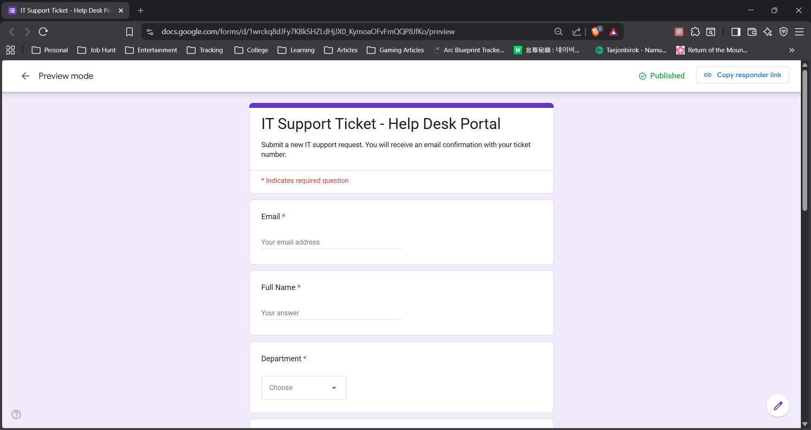
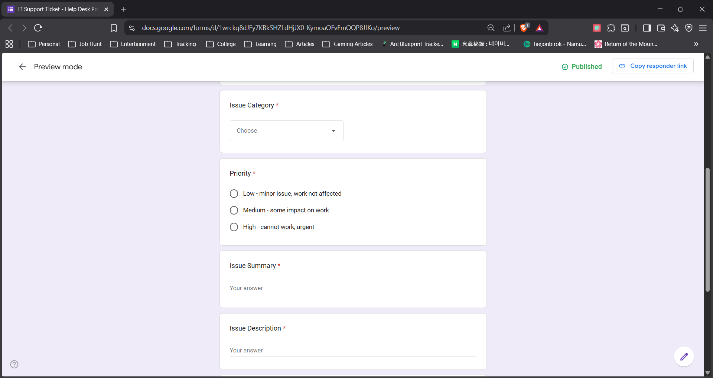
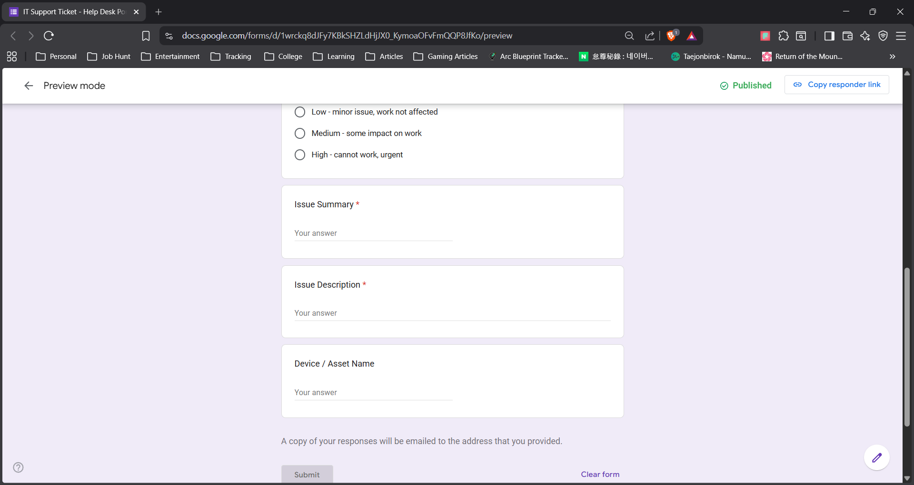
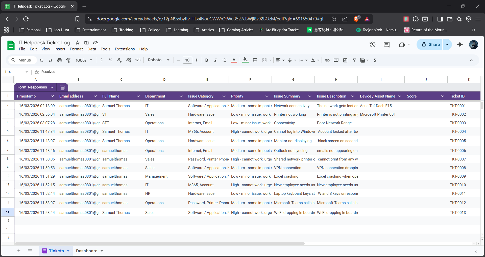
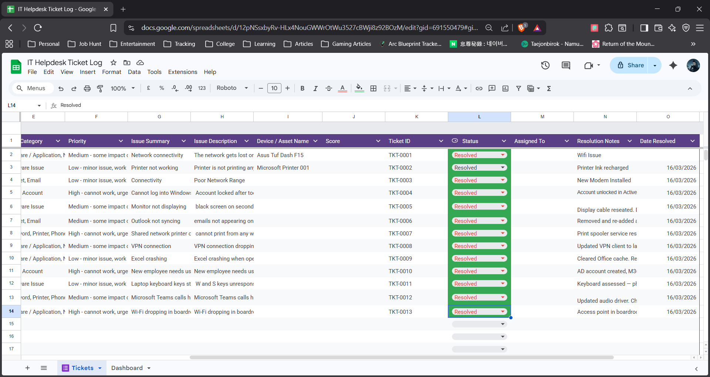
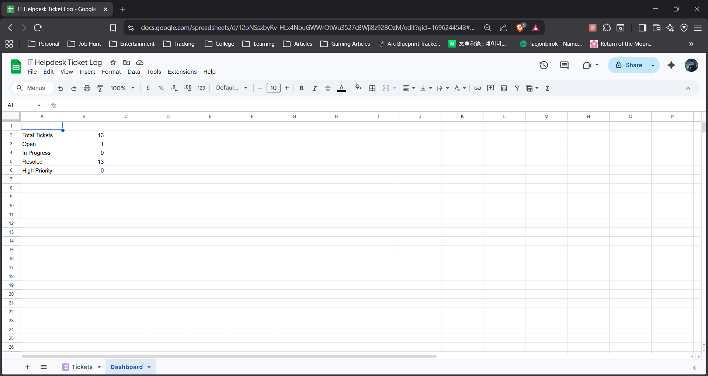
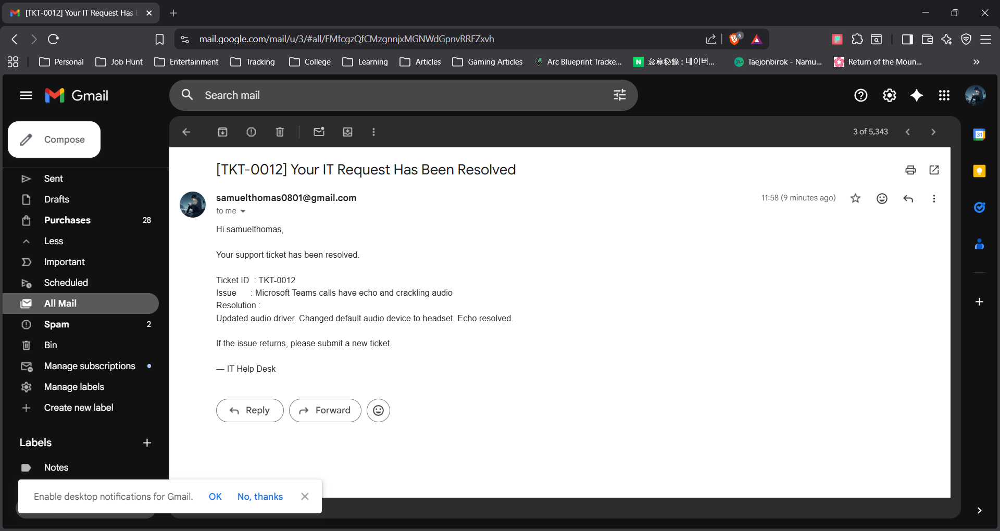

# Helpdesk-ticketing-system

A simulated IT support ticketing system built with
Google Forms, Google Sheets, and Google Apps Script.
Demonstrates Tier 1/2 help desk workflows including
ticket intake, status tracking, and automated email
communication.

## What it does
- Users submit tickets via a Google Form portal
- Each ticket is auto-assigned a unique ID (TKT-XXXX)
- Confirmation email sent automatically on submission
- Status tracked in real-time: Open / In Progress / Resolved
- Resolution email sent automatically when ticket is closed
- Dashboard sheet shows live ticket counts by status

## Tools used
- Google Forms — ticket submission interface
- Google Sheets — ticket log and dashboard
- Google Apps Script (JavaScript) — email automation
- Gmail API — automated email delivery

## Screenshots

## Sample tickets
10 realistic IT support scenarios are documented
in sample-tickets.csv, covering hardware, software,
network, M365, and account management issues.

## Skills demonstrated
- ITSM workflow design
- Ticket lifecycle management
- Automated communication workflows
- Technical documentation
- Google Workspace administration
